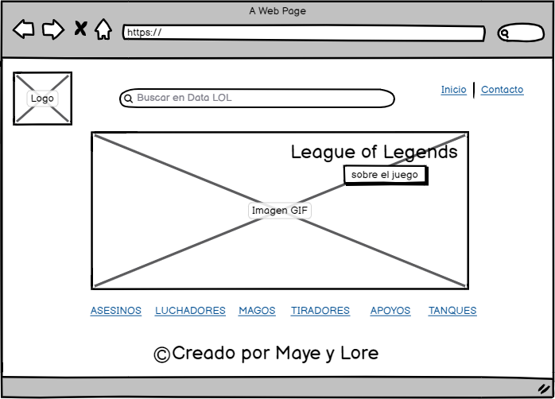
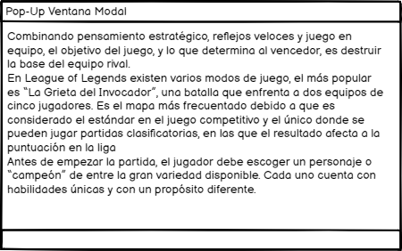
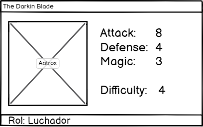
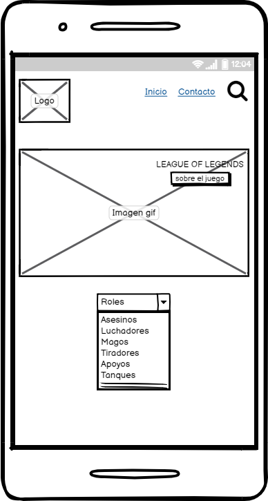
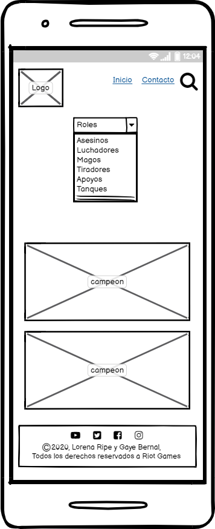
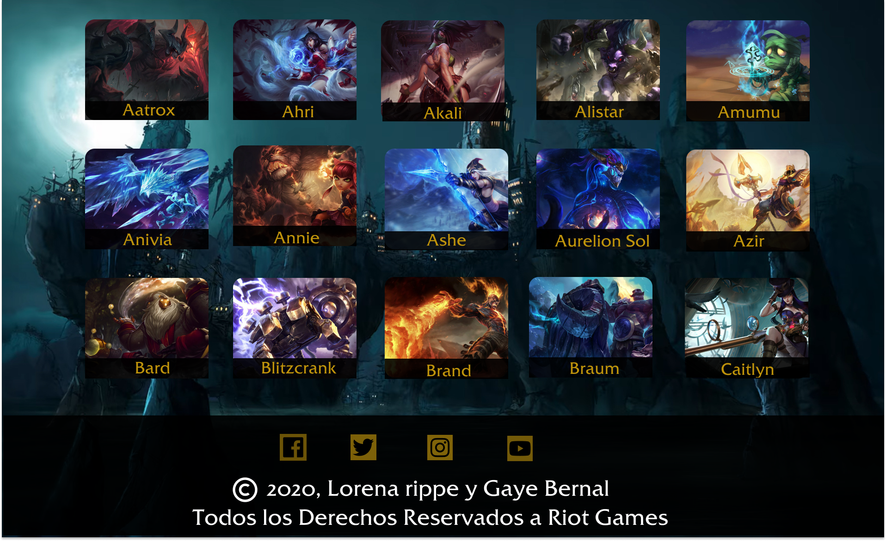
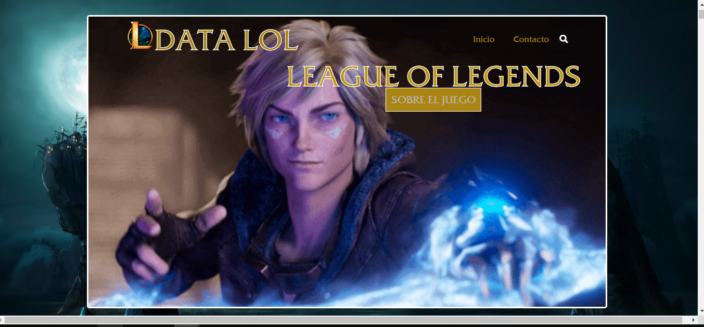

# Data Lol

## Índice

- [Data Lol](#data-lol)
  - [Índice](#índice)
  - [1. Preámbulo](#1-preámbulo)
  - [2. Resumen del desarrollo del proyecto](#2-resumen-del-desarrollo-del-proyecto)
  - [3. Carpetas que encontrarás en el repositorio](#3-carpetas-que-encontrarás-en-el-repositorio)
  - [SRC](#src)
    - [DATA](#data)
    - [Imagenes](#imagenes)
  - [TEST](#test)
  - [README](#readme)
    - [Recursos visuales](#recursos-visuales)
  - [4. Sketch inicial - Baja fidelidad](#4-sketch-inicial---baja-fidelidad)
    - [4.1 Vista en ordenador](#41-vista-en-ordenador)
    - [4.2 Vista en mobile](#42-vista-en-mobile)
  - [5. Sketch Final - Alta fidelidad](#5-sketch-final---alta-fidelidad)
    - [5.1 Vista en ordenador](#51-vista-en-ordenador)
    - [5.1 Vista en mobile](#51-vista-en-mobile)
  - [6. Look final del proyecto](#6-look-final-del-proyecto)
    - [6.1   Vista de ordenador](#61-vista-de-ordenador)
    - [6.2 Look final del proyecto en vista de mobile](#62-look-final-del-proyecto-en-vista-de-mobile)
  - [7. Planning del proyecto](#7-planning-del-proyecto)
  - [8. Objetivos de aprendizaj906](#8-objetivos-de-aprendizaj906)
    - [HTML y CSS](#html-y-css)
    - [DOM y Web APIs](#dom-y-web-apis)
    - [JavaScript](#javascript)
    - [Testing](#testing)
    - [Estructura del código y guía de estilo](#estructura-del-código-y-guía-de-estilo)
    - [Git y GitHub](#git-y-github)
    - [UX](#ux)

## 1. Preámbulo

Este es el segundo proyecto que desarrollamos en el Bootcamp de [Laboratoria], propusimos una pagina donde mostrara la informacion acerca del juego [League of Legends - Challenger leaderboard](src/data/lol/lol.json), el objetivo principal de este proyecto fue visualizar la data, filtrarla, ordenarla y se agrego una barra de busqueda donde muestra cada campeon por nombre.

## 2. Resumen del desarrollo del proyecto

Tras leer el [README] hicimos un sketch de baja fidelidad en balsamiq y un sketch de alta fidelidad en figma, donde  se llevó a cabo una sesión de feedback todos los martes en cada sprint donde tuvimos la oportunidad de hacer mejoras prontas al prototipo de alta fidelidad.
Forkeamos el proyecto base, lo desarrollamos localmente, desarrollamos la estructura básica en html, luego nos enfocamos en JavaScript mientras generabamos recursos visuales e interactuábamos con CSS y asi mismo nos efocamos en manipular las funciones para testearlas.

## 3. Carpetas que encontrarás en el repositorio

## SRC

### DATA
 | Archivo   | Descripción                    |
 | :-------- | :----------------------------- |
 | lol.js    | Data del juego                 |
 | lol.json  | Data del juego - version .json |
 | README.md | Historia de los campeones      |

### Imagenes
Carpeta con material visual utilizado en el cuerpo del proyecto

 | Archivo    | Descripción                                          |
 | :--------- | :--------------------------------------------------- |
 | index.html | Página principal                                     |
 | main.js    | Interaccion con el DOM                               |
 | data.js    | Manipulacion de datos a través de arreglos y Objetos |
 | style.css  | Estilos del proyecto global                          |

 ## TEST

 | Archivo      | Descripción                                                         |
 | :----------- | :------------------------------------------------------------------ |
 | data.spec.js | Test Unitarios de las funciones implementadas en el archivo data.js |

## README

 | Archivo   | Descripción                                         |
 | :-------- | :-------------------------------------------------- |
 | Readme.md | Informacion del proyecto y objetivos de aprendizaje |

### Recursos visuales

| Carpeta  | Descripción                                                     |
| :------- | :-------------------------------------------------------------- |
| Imagenes | Carpeta con material visual utilizado en el cuerpo del proyecto |

## 4. Sketch inicial - Baja fidelidad

### 4.1 Vista en ordenador

### 4.2 Vista en mobile

## 5. Sketch Final - Alta fidelidad

### 5.1 Vista en ordenador

### 5.1 Vista en mobile

## 6. Look final del proyecto  

### 6.1   Vista de ordenador

### 6.2 Look final del proyecto en vista de mobile

## 7. Planning del proyecto

Utilizamos [Trello] como herramienta de coordinación para el óptimo desarrollo del proyecto, para verlo da click [aquí](https://trello.com/b/rJaw2mXr/datalol).

## 8. Objetivos de aprendizaj906

El objetivo principal de este proyecto es que aprendas a diseñar y construir una interfaz web donde se pueda visualizar y manipular data, entendiendo lo que el usuario necesita.

### HTML y CSS

* [ ] [Uso de HTML semántico.](https://developer.mozilla.org/en-US/docs/Glossary/Semantics#Semantics_in_HTML)
* [ ] Uso de selectores de CSS.
* [ ] Construir tu aplicación respetando el diseño realizado (maquetación).
* [ ] [Uso de flexbox en CSS.](https://css-tricks.com/snippets/css/a-guide-to-flexbox/)

### DOM y Web APIs

* [ ] Uso de selectores del DOM.
* [ ] Manejo de eventos del DOM.
* [ ] [Manipulación dinámica del DOM.](https://developer.mozilla.org/es/docs/Referencia_DOM_de_Gecko/Introducci%C3%B3n)
(appendChild |createElement | createTextNode| innerHTML | textContent | etc.)

### JavaScript

* [ ] Uso de condicionales (if-else | switch | operador ternario)
* [ ] Uso de bucles (for | for..in | for..of | while)
* [ ] Uso de funciones (parámetros | argumentos | valor de retorno)
* [ ] Manipular arrays (filter | map | sort | reduce)
* [ ] Manipular objects (key | value)
* [ ] Uso ES modules ([`import`](https://developer.mozilla.org/en-US/docs/Web/JavaScript/Reference/Statements/import)
| [`export`](https://developer.mozilla.org/en-US/docs/Web/JavaScript/Reference/Statements/export))
* [ ] Diferenciar entre expression y statements.
* [ ] Diferenciar entre tipos de datos atómicos y estructurados.

### Testing

* [ ] [Testeo unitario.](https://jestjs.io/docs/es-ES/getting-started)

### Estructura del código y guía de estilo

* [ ] Organizar y dividir el código en módulos (Modularización)
* [ ] Uso de identificadores descriptivos (Nomenclatura | Semántica)
* [ ] Uso de linter (ESLINT)

### Git y GitHub

* [ ] Uso de comandos de git (add | commit | pull | status | push)
* [ ] Manejo de repositorios de GitHub (clone | fork | gh-pages)
* [ ] Colaboración en Github (branches | pull requests | |tags)

### UX

* [ ] Diseñar la aplicación pensando y entendiendo al usuario.
* [ ] Crear prototipos para obtener feedback e iterar.
* [ ] Aplicar los principios de diseño visual (contraste alineación, jerarquía)
* [ ] Planear y ejecutar tests de usabilidad.